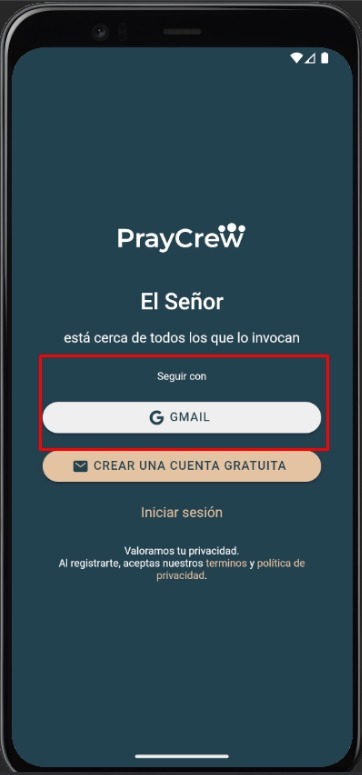
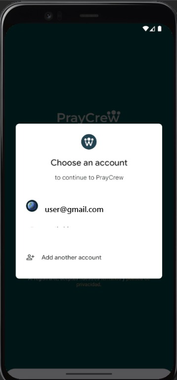
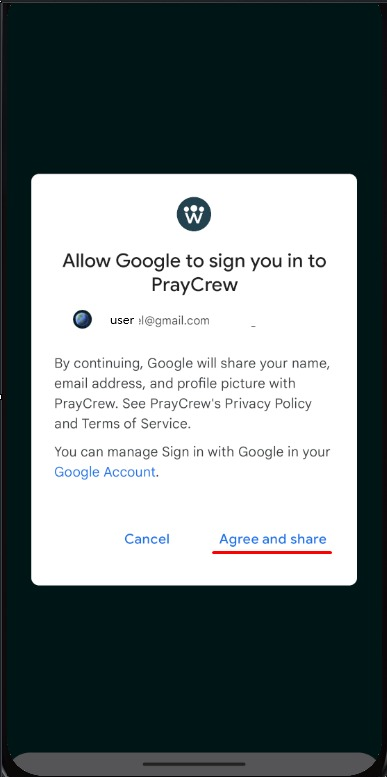

# Iniciar sesión con Google

Este flujo utiliza la autenticación OAuth de Google, de modo que no necesitas contraseña propia de PrayCrew.

---

## Requisitos previos

- Contar con una cuenta de Google activa.  
- Haber aceptado el permiso de PrayCrew durante el flujo de OAuth.

---

## Pasos

1. En la pantalla de login principal, haz clic en el botón **Iniciar sesión con Google**.  
2. Serás redirigido a la interfaz de Google; si no estás autenticado, ingresa tu cuenta.  
3. Google te pedirá que **permitas** a PrayCrew acceder a tu perfil básico (correo y nombre).  
4. Tras el consentimiento, volverás automáticamente al Dashboard de PrayCrew, ya logueado.

---

## Capturas de pantalla

  
*Botón “Continue with Gmail” en la pantalla de inicio.*

  
*Diálogo nativo de Android para elegir la cuenta de Google.*

  
*Pantalla de consentimiento: “Allow Google to sign you in to PrayCrew”.*

---

## Errores comunes

| Errores comunes| Motivo                            | Solución                                 |
|-------------   |-----------------------------------|----------------------------------------|
|                | Solicitud inválida                | Refresca la página e inténtalo de nuevo. |
|                | Token denegado o caducado         | Vuelve a autorizar en Google.            |
|                | Usuario no registrado en PrayCrew | Completa primero el registro con el mismo correo. |

