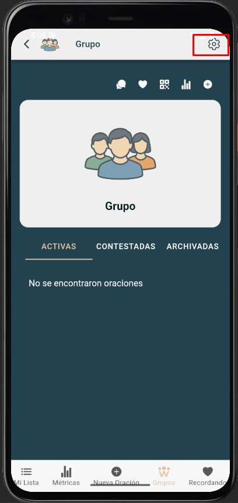
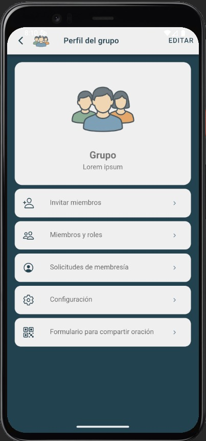

# Miembros y roles

Visualiza los miembros del grupo y sus permisos básicos.

---

## Pasos
1. Abre **Grupos de Oración → Miembros y roles**.
2. Selecciona el **grupo**.
3. Revisa la lista de miembros y su **rol** (miembro/admin).

---

## Acciones (si tu rol lo permite)
- Promocionar o revocar rol de **Administrador**.
- **Quitar** miembros del grupo.

---

## Capturas de pantalla

---

## Errores comunes
| Error | Motivo | Solución |
|---|---|---|
| No puedo cambiar roles | No eres admin | Solicita permisos al administrador |
