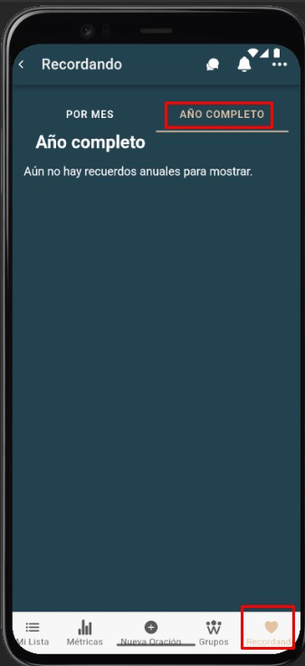

# Recordando año completo

La pestaña **Whole year** muestra el resumen anual de recuerdos.

---

## Pasos
1. Cambia a **Whole year** en **Remember**.  
2. Revisa el resumen del año actual.  
3. (Si aplica) Cambia de año con los controles de navegación.

---

## Capturas de pantalla

*Vista “Whole year”.*

---

## Errores comunes

| Error | Motivo | Solución |
|---|---|---|
| “There are no annual memories to display yet.” | No hay datos ese año | Genera actividades o revisa otro año. |
| No carga el resumen | Conexión o sesión expirada | Reintenta o vuelve a iniciar sesión. |
