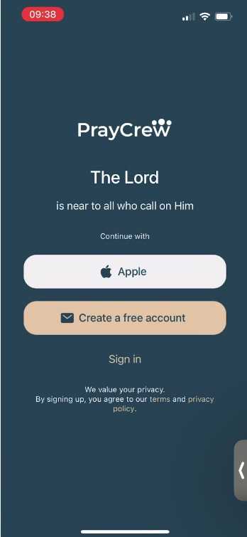
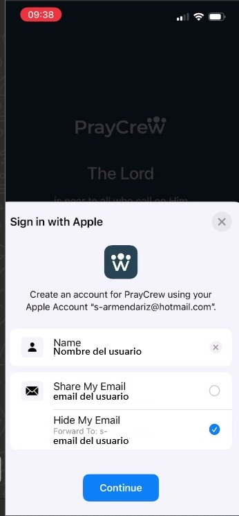

# Registro en iOS

## Descripción
En la versión actual de la app PrayCrew para dispositivos iOS, los métodos de registro disponibles son:

1. **Crear una cuenta manualmente**: ingresando nombre, correo electrónico y contraseña.
2. **Crear una cuenta usando Gmail**: autenticándose con una cuenta de Google.

📌 La opción de registro directo con **Apple ID** no está disponible por el momento.

---

## Pasos
1. Abrir la aplicación **PrayCrew** en un dispositivo iOS.
2. En la pantalla inicial, tocar **Create a Free Account** (crear cuenta gratuita).
3. Elegir uno de los métodos de registro disponibles:

   - **Crear cuenta manualmente**:
     1. Completar el formulario con la siguiente información:
        - **First name** (nombre)
        - **Last name** (apellido)
        - **Email** (correo electrónico)
        - **Confirm email address** (confirmar correo electrónico)
        - **Password** (contraseña)
        - **Confirm password** (confirmar contraseña)
     2. Pulsar **Continue**.
     3. Aparecerá una pantalla confirmando la creación de la cuenta y solicitando verificar el correo electrónico.
     4. Revisar el correo electrónico y hacer clic en el enlace de verificación enviado por PrayCrew.

   - **Crear cuenta usando Gmail**:
     1. Seleccionar la opción **Gmail** en la pantalla inicial.
     2. Elegir la cuenta de Google en el dispositivo o iniciar sesión con usuario y contraseña de Google.
     3. Autorizar a PrayCrew para vincular la cuenta.
     4. Una vez finalizado el proceso, se accederá directamente a la aplicación sin necesidad de verificación por correo.

---

## Capturas de pantalla
**Pantalla inicial**

**Formulario de registro**

**Selección de cuenta Gmail**

**Confirmación de cuenta creada**

