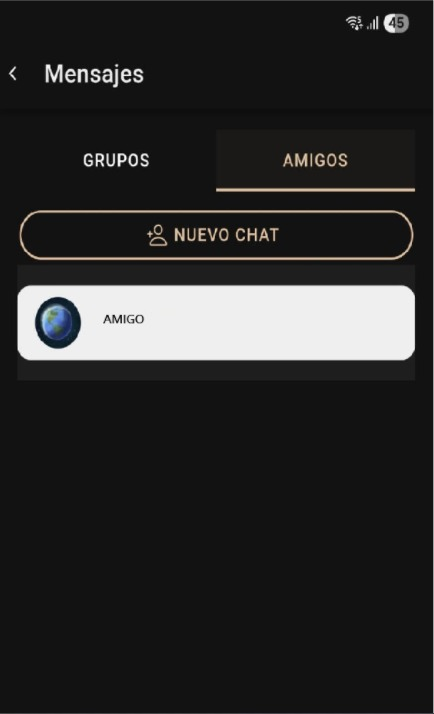

## Chat con amigos

### Descripción general
El **Chat con amigos** habilita conversaciones privadas entre dos usuarios que se tienen agregados como contactos dentro de PrayCrew.

### Flujos principales
1. El usuario accede a su lista de amigos.
2. Selecciona un contacto y abre la conversación.
3. Visualiza el historial de mensajes previos y los nuevos mensajes en tiempo real.
4. Envía textos, emojis y, según configuración futura, archivos adjuntos.
5. Recibe notificaciones en tiempo real cuando su amigo responde.

### Datos involucrados
- ID del remitente.
- ID del destinatario.
- Contenido del mensaje.
- Fecha y hora de envío.
- Estado del mensaje (enviado, entregado, leído).

### Reglas de negocio
- Solo usuarios que se tengan mutuamente como amigos pueden iniciar un chat privado.
- El sistema debe garantizar la confidencialidad y cifrado de los mensajes.
- El historial de conversación solo es visible para los dos participantes.
- Se debe mostrar el estado de conexión del amigo (en línea / desconectado) si está habilitado.
- Notificaciones push deben enviarse en caso de recibir un mensaje nuevo.

 

 
