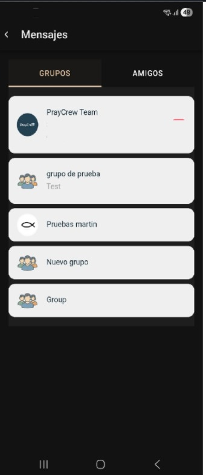

## Chat de grupo

### Descripción general
El **Chat de grupo** permite a los miembros de un grupo de oración comunicarse en un espacio común.  
Todos los mensajes enviados en este canal son visibles para los integrantes del grupo, fomentando la interacción y coordinación.

### Flujos principales
1. El usuario accede a un grupo de oración desde el listado disponible.
2. Selecciona la opción **Chat de grupo**.
3. Visualiza el historial de mensajes previos y los nuevos mensajes en tiempo real.
4. Puede enviar textos, emojis y, según configuración futura, archivos adjuntos.
5. Los mensajes se muestran con información básica del remitente (nombre y hora de envío).

### Datos involucrados
- ID del grupo de oración.
- ID del remitente.
- Contenido del mensaje.
- Fecha y hora de envío.
- Estado del mensaje (enviado, entregado, leído).

### Reglas de negocio
- Solo miembros activos del grupo pueden participar en el chat.
- Los mensajes se almacenan de forma segura y se muestran en orden cronológico.
- El administrador del grupo puede moderar o eliminar mensajes si es necesario.

### Captura de pantalla
 

 