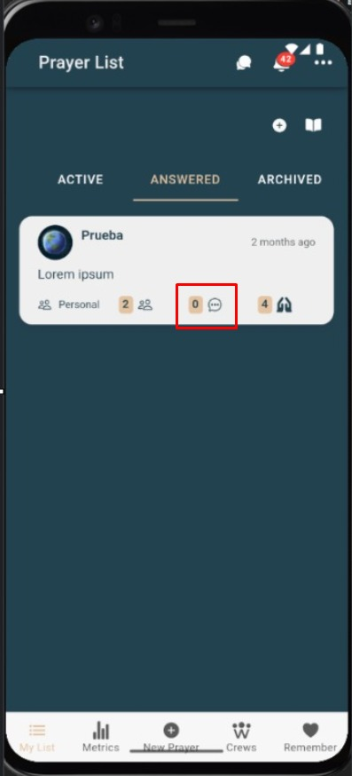

# Comentar

Agrega un comentario a la conversación de la oración (visible para el grupo).

---

## Pasos
1. En el **detalle de la oración**, ve a la sección **Comentarios**.
2. Escribe tu mensaje.
 

---

## Buenas prácticas
- Sé claro, breve y respetuoso.
- Evita datos sensibles que el solicitante no quiera compartir.

---

## Capturas

---

## Errores comunes

| Error | Motivo | Solución |
|---|---|---|
| No se publica | Sin conexión | Reintenta cuando tengas internet. |
| No ves tu comentario | Caché o permisos | Actualiza la vista o verifica tus permisos. |
