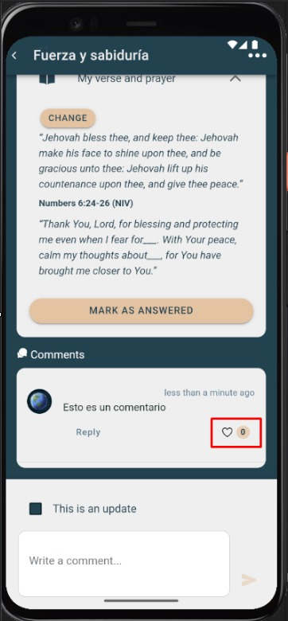

# Like comentario

Permite indicar “me gusta” en un comentario.

---

## Pasos
1. En la sección **Comentarios**, ubica el mensaje.
2. Toca el ícono de **Like**.
3. El contador se actualizará. Puedes volver a tocar para quitar el like.

---

## Capturas

---

## Notas
- Los likes ayudan a resaltar mensajes útiles o testimonios.
- Algunos grupos muestran quiénes dieron like; depende de configuración.
