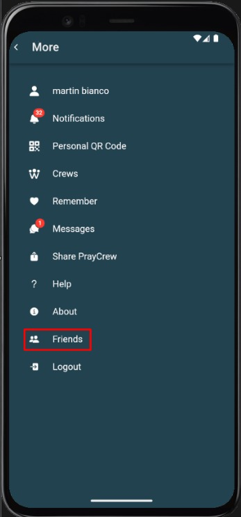
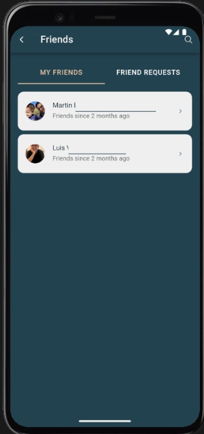

## Lista de mis amigos

### Descripción general
La sección **Lista de mis amigos** muestra todos los contactos que has agregado en la plataforma PrayCrew.  
Desde aquí puedes interactuar de forma directa con ellos, iniciar conversaciones y gestionar tu lista de amistades.

### Cómo acceder
1. Desde el menú principal, selecciona la opción **Amigos**.
2. Pulsa en **Lista de mis amigos**.
3. Se mostrará el listado completo de tus contactos agregados en la plataforma.

### Acciones disponibles
- **Ver perfil**: Accede a la información pública de tu amigo.
- **Iniciar chat**: Abre una conversación privada con el contacto seleccionado.
- **Eliminar amigo**: Quita el contacto de tu lista (esta acción es irreversible).

### Captura de pantalla

### Errores comunes

| Error                              | Motivo                                                        | Solución                                                            |
|------------------------------------|---------------------------------------------------------------|---------------------------------------------------------------------|
| Lista vacía                        | No tienes contactos agregados                                 | Envía solicitudes de amistad desde la sección "Solicitudes de amistad". |
| No puedo iniciar un chat           | El usuario eliminó su cuenta o te eliminó como amigo          | Verifica si sigue en tu lista y envía una nueva solicitud si es necesario. |
| No se carga la lista de amigos     | Problemas de conexión a internet o fallo temporal de la app   | Comprueba tu conexión y recarga la pantalla.                        |
| Error al eliminar un amigo         | Sesión expirada o problema en la solicitud al servidor        | Cierra sesión y vuelve a iniciarla antes de intentar de nuevo.      |
