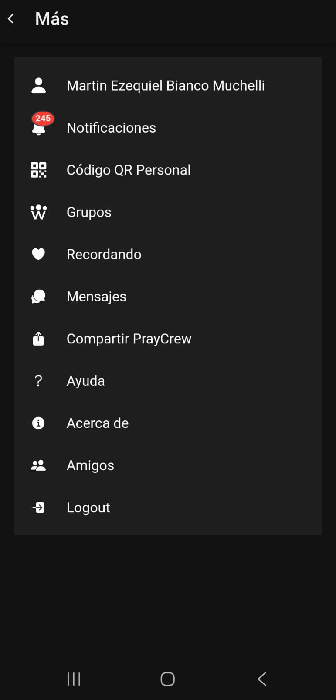

## Menú Más

### Descripción general
El **Menú Más** agrupa accesos directos a funcionalidades complementarias de la aplicación PrayCrew que no forman parte del menú principal.  
Desde esta sección, el usuario puede acceder rápidamente a herramientas, opciones de configuración y utilidades adicionales para gestionar su cuenta y su interacción dentro de la plataforma.

### Funciones disponibles
El Menú Más puede incluir, entre otros, los siguientes accesos:

- **Perfil de usuario**: Visualizar y editar información personal.
- **Notificaciones**: Acceso a la bandeja de notificaciones con actualizaciones y avisos.
- **Código QR personal**: Generar y compartir tu código QR para conectar con otros usuarios.
- **Grupos**: Acceso rápido a la lista de grupos en los que participas.
- **Recordando**: Función para gestionar recordatorios personales.
- **Mensajes**: Acceso directo a los chats activos.
- **Compartir PrayCrew**: Enviar invitaciones para que otros descarguen y usen la aplicación.
- **Ayuda**: Información y soporte de uso de la plataforma.
- **Acerca de**: Información sobre la aplicación.
- **Amigos**: Gestión de tu lista de contactos.
- **Logout**: Cerrar sesión en la aplicación.

### Cómo acceder
1. Desde la pantalla principal, abre el menú lateral haciendo tap en los tres puntos (arriba a la derecha)
3. Selecciona la funcionalidad que desees utilizar.

### Errores comunes
- **No encuentro una función específica**: Verifica si está dentro del Menú Más, ya que algunas opciones se agrupan aquí para mantener el menú principal más limpio.
- **No se actualiza la información**: Si una sección como Notificaciones o Mensajes no se actualiza, intenta refrescar la pantalla o cerrar y volver a abrir la aplicación.
- **No puedo cerrar sesión**: Si el botón Logout no responde, asegúrate de tener conexión a internet y vuelve a intentarlo.

### Captura de pantalla

