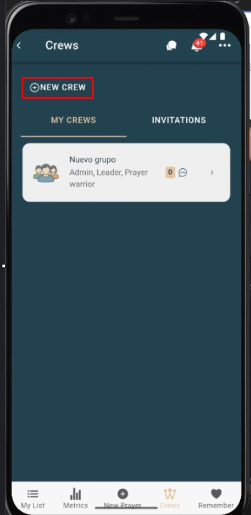
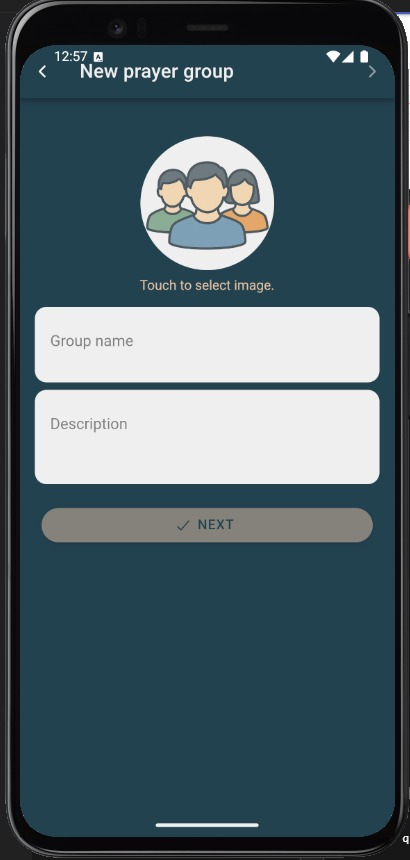
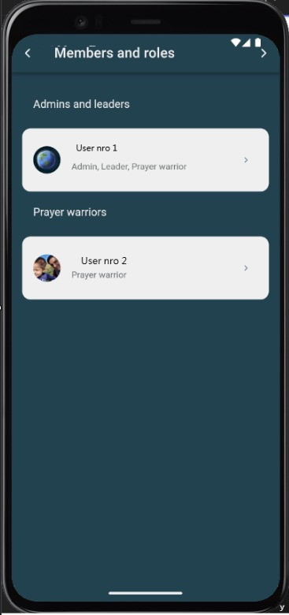

# Nuevo grupo (4 pasos)

Crea un grupo de oración para organizar peticiones y orar en comunidad. El proceso se realiza con un asistente en **4 pasos**.

---

## Requisitos previos
- Tener sesión iniciada y la cuenta **validada**.
- Conexión a internet.
- Un **nombre único** para el grupo.

---

## Pasos

### Paso 1 — Datos básicos
1. Toca **Nuevo grupo**.
2. Completa **Nombre** del grupo *(obligatorio)* y una **Descripción** breve.

> Resultado: se valida que el nombre no esté vacío y que no duplique otro grupo visible para ti.

---

### Paso 2 — Imagen e identidad
1. (Opcional) **Sube una imagen**/logo del grupo.

> Sugerencia: usa imágenes JPG/PNG livianas para mejor rendimiento.

---

### Paso 3 — Integrantes
1. Define opciones a los integrantes del grupo (Deben ser amigos)
2. Revisa opciones de **notificaciones** para el grupo (si aplica).

> Nota: estas preferencias pueden ajustarse después desde **Configuración** del grupo.

---

### Paso 4 — Invitar miembros y finalizar
1. Revisa el **resumen** del grupo.
2. Toca **Crear** para confirmar.
3. Invita personas con **enlace o QR** o desde tu lista de contactos.

Accesos útiles después de crear el grupo:
- **Invitar miembros**: ver [Invitar miembros](invitar-miembros.md)  
- **Compartir QR**: ver [QR compartir](qr-compartir.md)  
- **Configurar el grupo**: ver [Configuración](configuracion-grupo.md)  
- **Primera oración**: ver [Agregar oración a grupo](agregar-oracion-grupo.md)

---

## Capturas de pantalla
> Sube las imágenes a `docs/img/` con estos nombres o indícame otros y ajusto las rutas.

- 
- 
- 

---

## Errores comunes

| Error | Motivo | Solución |
|---|---|---|
| “El nombre es obligatorio” | No se completó el campo **Nombre** | Completa el nombre del grupo |
| “Nombre ya utilizado” | Existe otro grupo con el mismo nombre visible para ti | Usa un nombre diferente |
| “No se pudo crear el grupo” | Problemas de conexión | Revisa internet e inténtalo nuevamente |
| No aparecen opciones de invitación | Rol/permisos limitados | Pide a un admin que te asigne permisos o comparte el QR desde **QR compartir** |

---

