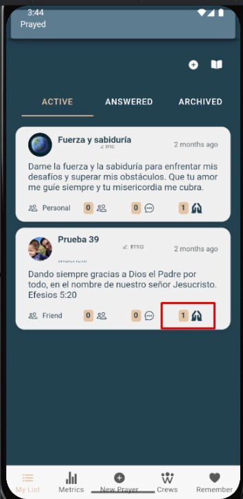

# Orar

Permite registrar que oraste por una petición. Al hacerlo, se incrementa el contador y quedas visible en **Lista de personas que han orado**.

---

## Requisitos previos
- Estar viendo el **detalle de la oración**.
- Tener permiso en el grupo (si aplica).

---

## Pasos
1. Abre la oración desde **Mi Lista** o desde un grupo.
2. Toca **Orar**.
3. Verás el estado **Orado** y el contador aumentará.

---

## Capturas

*Botón para registrar que oraste.*

---

## Errores comunes

| Error | Motivo | Solución |
|---|---|---|
| No aparece el botón | No tienes permisos / sesión expirada | Vuelve a iniciar sesión o contacta al admin del grupo. |
| No incrementa el contador | Fallo de conexión | Reintenta con buena conexión. |
