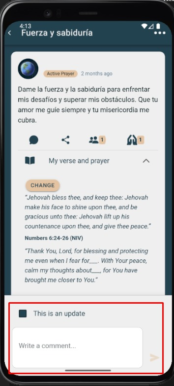

# Responder

Permite **responder a un comentario** específico dentro del hilo de la oración.

---

## Pasos
1. En **Comentarios**, toca **Responder** debajo del mensaje al que contestarás.
2. Escribe tu respuesta.
3. Toca **Enviar**. La respuesta quedará anidada al comentario original.

---

## Capturas

---

## Notas
- El autor del comentario puede recibir una notificación.
- Puedes mencionar a alguien escribiendo su nombre si la app lo soporta.
