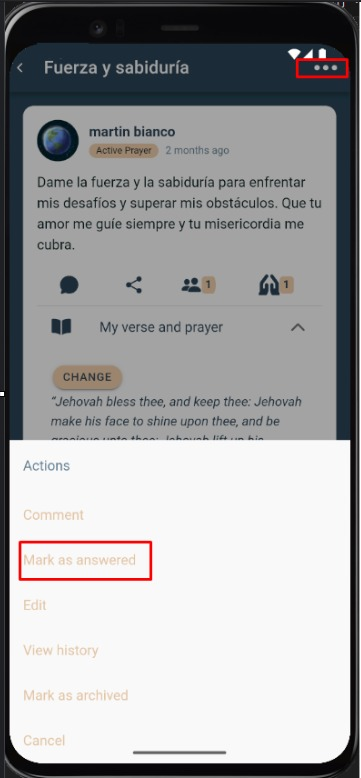

# Respuesta de Dios

Marca la oración como **Respondida** y registra el testimonio.

---

## Pasos
1. Abre el **detalle de la oración**.
2. Toca **Respuesta de Dios**.
3. Describe brevemente la respuesta y confirma.

---

## Impacto
- La oración cambia a estado **Respondida**.
- Afecta las **métricas** (Answered / Answered prayer rate).
- Puede mover la oración al histórico/archivadas según la configuración.

---

## Capturas

---

## Errores comunes

| Error | Motivo | Solución |
|---|---|---|
| Opción no disponible | No tienes permisos | Solicítalo al admin o al autor de la oración. |
