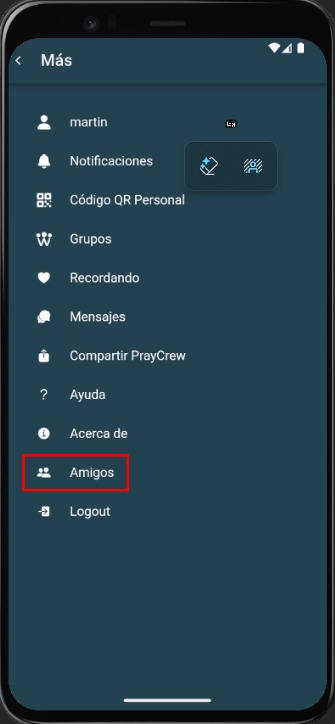
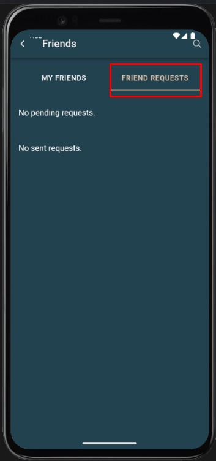
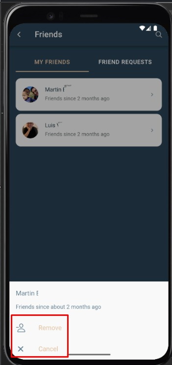
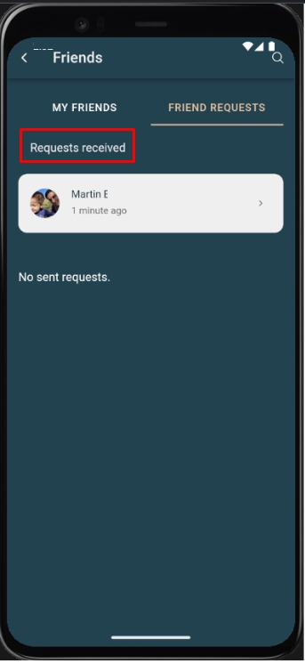
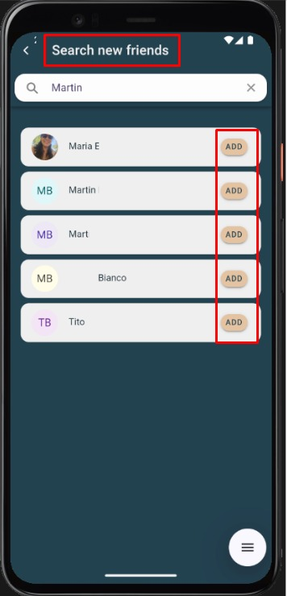

## Solicitudes de amistad

### Descripción general
La sección **Solicitudes de amistad** permite gestionar las invitaciones enviadas y recibidas dentro de la plataforma PrayCrew.  
Desde aquí puedes aceptar nuevas amistades, rechazarlas o cancelar solicitudes que hayas enviado.

### Cómo acceder
1. Desde el menú principal, selecciona la opción **Amigos**.
2. Pulsa en **Solicitudes de amistad**.
3. Se mostrará un listado con las solicitudes pendientes.

### Acciones disponibles
- **Aceptar solicitud**: Agrega al usuario a tu lista de amigos.
- **Rechazar solicitud**: Declina la invitación sin agregar al usuario.
- **Cancelar solicitud enviada**: Retira una invitación que enviaste y que aún no fue respondida.

### Captura de pantalla

### Errores comunes

| Error                                | Motivo                                                        | Solución                                                            |
|--------------------------------------|---------------------------------------------------------------|---------------------------------------------------------------------|
| Lista vacía                          | No tienes solicitudes pendientes enviadas o recibidas         | Espera a recibir nuevas solicitudes o envía invitaciones a otros usuarios. |
| No puedo aceptar la solicitud        | El usuario canceló su invitación antes de que la aceptaras    | Envía una nueva solicitud si quieres conectar con esa persona.      |
| Error al rechazar o cancelar solicitud | Sesión expirada o problema de conexión a internet             | Vuelve a iniciar sesión y revisa tu conexión antes de intentarlo.   |
| Solicitud aceptada pero no aparece en la lista de amigos | Fallo temporal de sincronización                              | Recarga la lista de amigos o cierra y vuelve a abrir la aplicación. |
