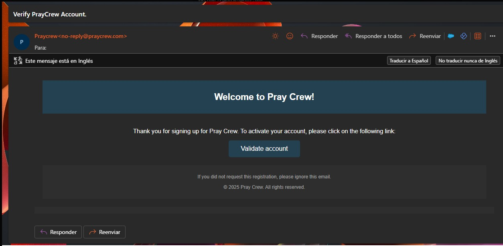

# Validar cuenta

## Descripción
Después de crear una cuenta en PrayCrew (ya sea manualmente o usando Gmail), es necesario validar la dirección de correo electrónico para completar el registro.  
Esta validación asegura que la cuenta esté asociada a un correo real y que el usuario pueda recibir notificaciones importantes.

---

## Pasos
1. Abrir la aplicación **PrayCrew**.
2. Revisar la bandeja de entrada del correo electrónico registrado.
3. Buscar el mensaje enviado por **PrayCrew** con el asunto similar a **"Verifica tu cuenta"**.
4. Abrir el correo y localizar el botón o enlace **Verificar cuenta**.
5. Pulsar el enlace; se abrirá el navegador confirmando que la cuenta ha sido validada correctamente.
6. Regresar a la app e iniciar sesión con las credenciales registradas.

---

## Capturas de pantalla

**Correo de validación**  

**Enlace de verificación**  

