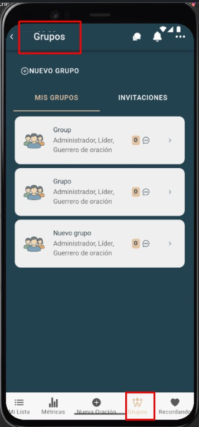
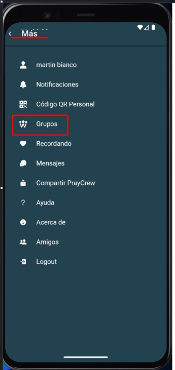

# Lista de grupos

Muestra todos los grupos de oración a los que perteneces o administras. Desde aquí puedes entrar al detalle del grupo.

---

## Pasos
1. Abre **Grupos de Oración → Lista de grupos**.
2. Usa la **barra de búsqueda** para filtrar por nombre.
3. Toca un grupo para abrir su ficha.

---

## Acciones rápidas
- **Ver detalle** del grupo.
- **Ver métricas** del grupo.
- **Compartir QR** del grupo (si está disponible).

---

## Capturas de pantalla
  

---

## Errores comunes
| Error | Motivo | Solución |
|---|---|---|
| Lista vacía | Aún no te uniste a ningún grupo | Únete con QR o pide invitación |
