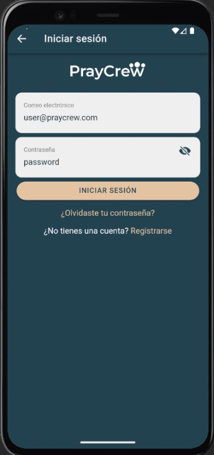
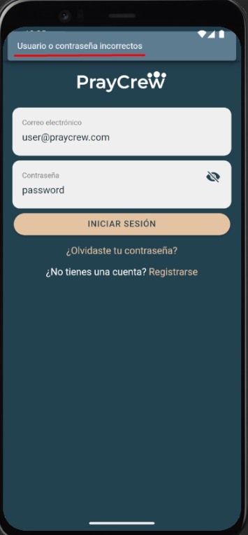

# Iniciar sesión con Usuario y Contraseña

Esta opción permite acceder a la plataforma PrayCrew utilizando las credenciales propias (correo y contraseña) creadas durante el registro.

---

## Requisitos previos

- Haber completado el registro con correo electrónico y contraseña.  
- La cuenta debe estar validada (ver sección [Validar cuenta](validar-cuenta.md)).

---

## Pasos

1. Accede al portal de PrayCrew.  
2. Introduce tu **correo electrónico** y **contraseña** en los campos correspondientes.  
3. Haz clic en **Iniciar sesión**.  
4. Si las credenciales y la verificación son correctas, serás redirigido al **Dashboard**.

---

## Capturas de pantalla

  
*Pantalla de inicio de sesión con usuario y contraseña (Android).*

  
*Mensaje “Usuario o contraseña incorrectos” cuando las credenciales no coinciden.*

---

## Errores comunes

|Errores comunes | Motivo                             | Solución                                                | 
|-------------|------------------------------------|------------------------------------------------------------|
| Err 1       | Credenciales inválidas             | Verifica correo y contraseña.                              |
| Err 2       | Cuenta no validada                 | Completa el proceso de validación ([verificar cuenta](validar-cuenta.md)). |
              |
