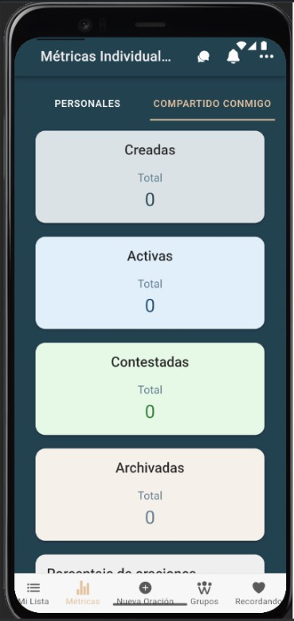
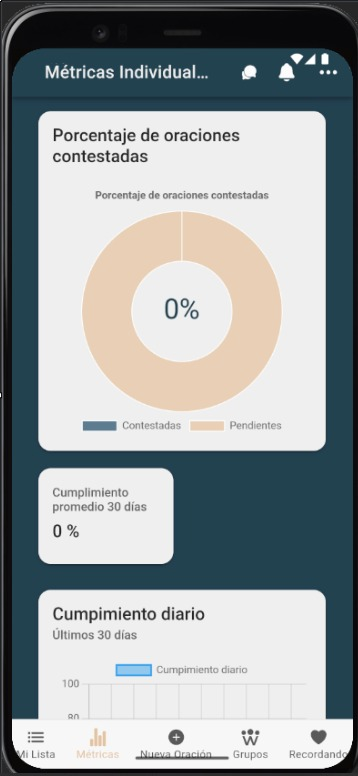
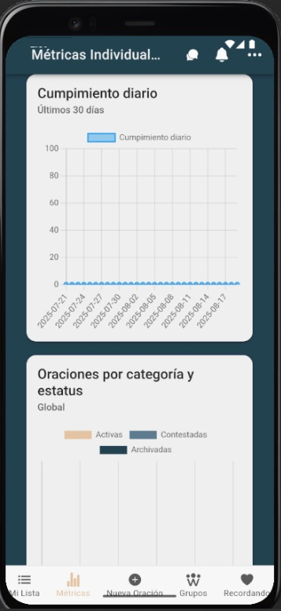
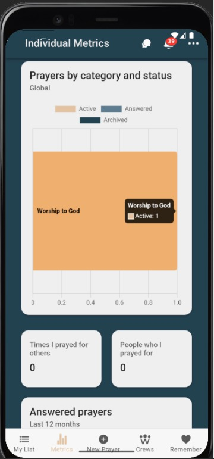
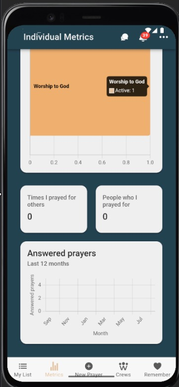

# Métricas compartido conmigo

Este panel muestra tus métricas **sobre oraciones que otros te compartieron**. Te ayuda a entender cuánto te llega, cuánto permanece activo y cuánto se ha contestado.

---

## Qué ves en esta pantalla

**Tarjetas superiores**
- **Recibidas (UI: Created):** total de oraciones que te compartieron.
- **Activas (UI: Active):** siguen abiertas/pedientes.
- **Contestadas (UI: Answered):** marcadas como respondidas.
- **Archivadas (UI: Archived):** cerradas/archivadas.

**Gráficos y KPIs**
- **Answered prayer rate:** porcentaje contestadas vs. totales (donut).
- **30 days average compliance:** cumplimiento promedio de los últimos 30 días.
- **Daily Prayer Completion (last 30 days):** línea/serie con el cierre diario.
- **Prayers by category and status:** distribución por categoría y estado (Activas, Contestadas, Archivadas).
- **Times I prayed for others:** veces que oraste por otros (dentro de este conjunto compartido).
- **People who I prayed for:** personas únicas por las que oraste.
- **Answered prayers (last 12 months):** evolución mensual de oraciones contestadas.

---

## Capturas de pantalla

  
*Creadas, activas, contestadas, archivadas.*

  
* “Porcentaje de oraciones contestadas + “Cumplimiento promedio de los ultimos 30 días”.*

  
Cumplimiento diario (ultimos 30 días)”.*

<!--  
*Prayers by category and status + Times I prayed for others + People who I prayed for.*

  
*Answered prayers (last 12 months).* -->

---

## Notas y tips
- Los conteos y porcentajes se **actualizan en tiempo real** con tu actividad.
- Los periodos visibles en los gráficos también están indicados en la UI (por ejemplo, *last 30 days*, *last 12 months*).
- Si ves valores en cero, puede ser simplemente que aún no hay actividad en el período seleccionado.
