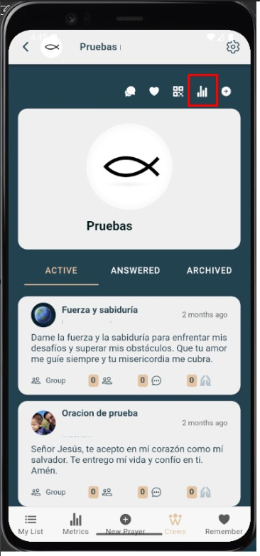
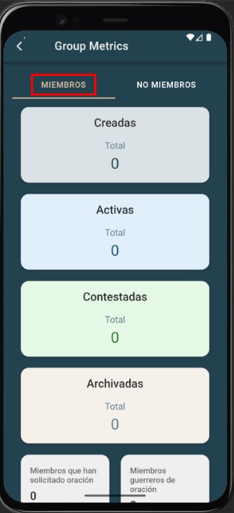
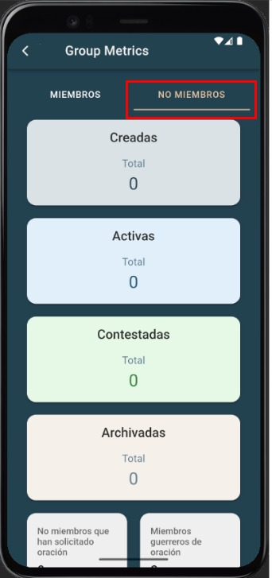

# Métricas de grupo

Indicadores del grupo: actividad, participación y evolución.

---

## Qué verás
- **Miembros únicos**, **Cantidad de oradores**
- Totales: **Enviadas, Respondidas, Abiertas, Archivadas**
- **% Completadas vs. Enviadas**
- **Ranking de oradores**
- **Prayers by category and status** (flag chart)
- Tendencias: **Daily/Checklist** (según disponibilidad)

---

## Pasos
1. Entra a **Grupos de Oración → Métricas de grupo**.
2. Elige el grupo (si corresponde).
3. Explora tarjetas y gráficos. Los datos se actualizan con la actividad.

---

## Capturas de pantalla
  
  

---

## Errores comunes
| Error | Motivo | Solución |
|---|---|---|
| Gráficos vacíos | Sin datos en el período | Cambia rango o genera actividad |
