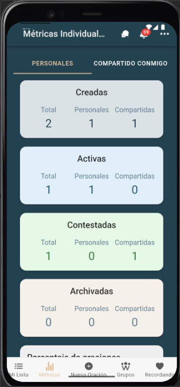
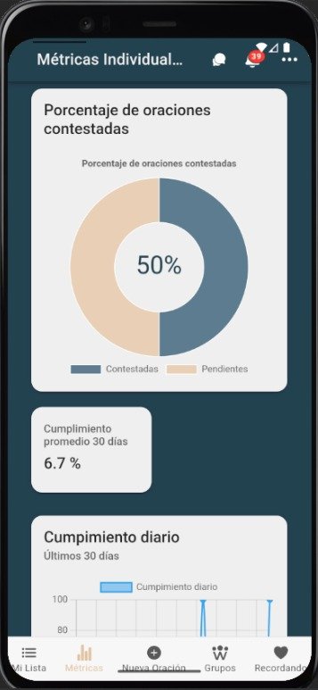
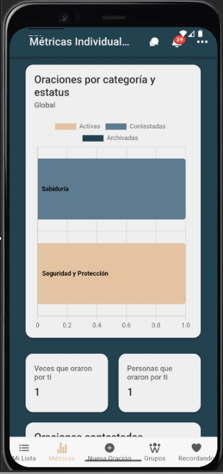

# Métricas personales

Panel con indicadores de mi actividad en PrayCrew (lo que yo envío/oro/gestiono).

---

## Requisitos previos
- Estar autenticado.
- Haber realizado al menos una acción (enviar oración, orar, comentar, etc.).

---

## Indicadores incluidos

| Indicador | Qué significa |
|---|---|
| **Oraciones enviadas** | Cantidad total de peticiones creadas por mí. |
| **Oraciones abiertas** | Mis peticiones que aún no tienen respuesta/cierre. |
| **Oraciones contestadas** | Mis peticiones con respuesta marcada. |
| **Oraciones archivadas** | Mis peticiones finalizadas y movidas a archivo. |
| **% completadas vs enviadas** | (Contestadas / Enviadas) * 100. |
| **Oraciones que he orado** | Veces que marqué “Orar” sobre peticiones de otros. |
| **Checklist completadas** | Cantidad de oraciones que marqué como completadas. |
| 

> Nota: los nombres pueden variar mínimamente según versión de la app.

---

## Filtros
- **Rango de fechas**: Hoy, 7 días, 30 días, Personalizado.
- **Estado**: Abiertas / Contestadas / Archivadas.

---

## Pasos
1. Abre el menú lateral y entra a **Métricas → Métricas personales**.  
2. Revisa las **tarjetas** con tus KPIs y los **gráficos** (tendencia / barras).  

---

## Capturas de pantalla
<!-- Sube las imágenes a `docs/img/` y respeta los nombres o ajusta aquí -->
  
*Tarjetas con KPIs + gráficos.*

  
*Controles de rango de fechas/estado.*

  
*Línea o barras con evolución temporal.*

---

## Errores comunes

| Error | Motivo | Solución |
|---|---|---|
| Panel vacío | Aún no tienes actividad | Genera al menos una petición u “orar” sobre una existente. |
| Filtros sin resultados | Rango/estado demasiado restrictivo | Limpia o ajusta los filtros. |
| No actualiza | Caché o sesión expirada | Recarga la página e inicia sesión de nuevo. |
