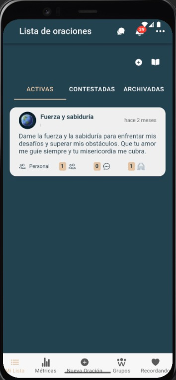
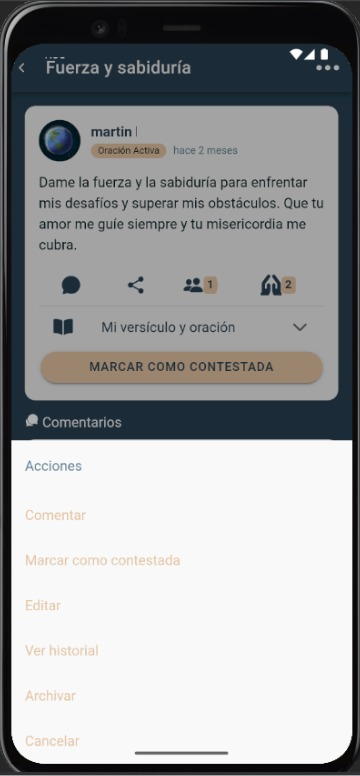

# Mi Lista

Esta sección muestra todas las oraciones que has enviado o marcado para seguimiento.

---

## Requisitos previos

- Estar autenticado en la plataforma.
- Haber enviado al menos una petición de oración.

---

## Pasos

1. Haz clic en **Mi Lista** en el menú lateral.  
2. Observa el listado de tus oraciones: título, fecha y estado.  
3. Para cada oración, puedes:  
   - **Marcarla como Finalizada**  
   - **Editar** el texto de la oración  
   - **Eliminar** la oración  

---

## Capturas de pantalla

  
*Vista completa de la sección “Mi Lista”.*

  
*Opciones de marcar como contestada, comentar, editar, ver historial y archivar.*

---

## Errores comunes

| Error                       | Motivo                             | Solución                                           |
|-----------------------------|------------------------------------|----------------------------------------------------|
| Lista vacía                 | No has enviado ninguna oración     | Envía tu primera petición desde “Agregar oración”. |
| Error al marcar "Contestada | Error de red o sesión expirada     | Recarga la página e inicia sesión de nuevo.        |
| Error al editar/eliminar    | Sesión expirada o recurso no encontrado | Verifica tu sesión o recarga la página.            |
