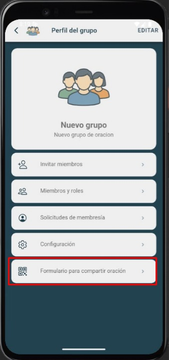
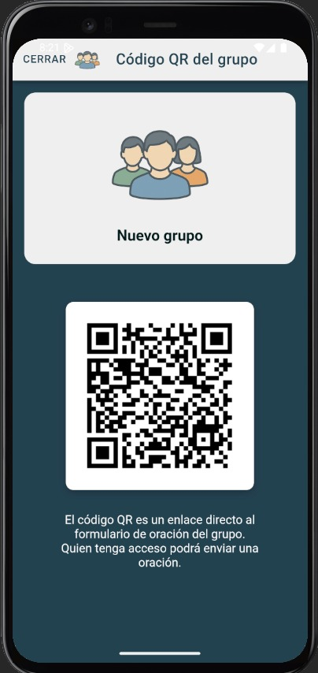

# QR compartir

Genera y comparte un **QR** o enlace para que otros se unan al grupo más rápido.

---

## Pasos
1. Abre **Grupos de Oración → QR compartir**.
2. Selecciona el **grupo**.
3. Muestra el **código QR** o copia el **enlace**.
4. La persona invitada escanea o abre el enlace y sigue el flujo de unión.

---

## Capturas de pantalla
  

---

## Errores comunes
| Error | Motivo | Solución |
|---|---|---|
| QR no abre | App/permiso de cámara | Pide abrir con la app o navegador |
| Enlace inválido | Venció o fue revocado | Genera un nuevo enlace/QR |
