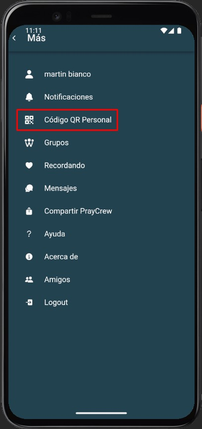
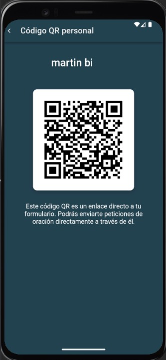

## QR personal

### Descripción general
El **QR personal** permite a cada usuario generar un código único que otros miembros pueden escanear para agregarlo como amigo o iniciar una interacción directa dentro de PrayCrew.  
Esta funcionalidad agiliza la conexión entre usuarios, evitando la necesidad de búsquedas manuales.

### Flujos principales
1. El usuario accede a la sección **Códigos QR** desde el menú principal.
2. Selecciona la opción **QR personal**.
3. El sistema muestra un código QR único vinculado a su cuenta.
4. Otro usuario escanea el código desde su dispositivo para enviar una solicitud de amistad o iniciar interacción.
5. El sistema confirma la acción y actualiza las listas de contactos.

### Datos involucrados
- ID del usuario.
- Información de vinculación (por ejemplo, token o enlace asociado).

### Reglas de negocio
- El código QR es único por usuario.
- Solo usuarios autenticados pueden generar o escanear códigos QR.

### Capturas de pantalla

