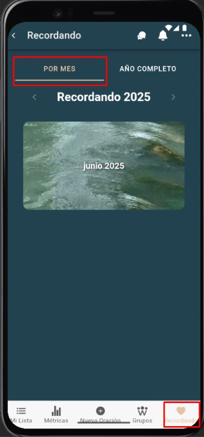

# Recordando por mes

La pestaña **Per month** muestra los recuerdos del mes seleccionado.

---

## Pasos
1. Abre **Remember** y asegúrate de estar en **Per month**.  
2. Usa las flechas **‹ / ›** para cambiar el mes.  
3. (Si hay elementos) Toca un recuerdo para ver el detalle.

---

## Capturas de pantalla

*Vista “Per month”.*

---

## Errores comunes

| Error | Motivo | Solución |
|---|---|---|
| No aparecen recuerdos | No hay eventos ese mes | Cambia de mes o crea nuevos eventos. |
| No cambian los datos al pasar de mes | Caché o conexión | Desliza para refrescar o revisa conexión. |
